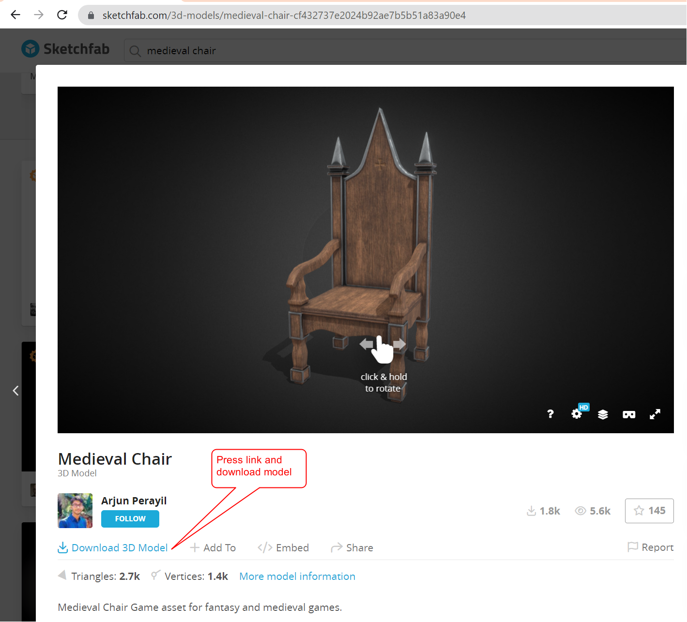
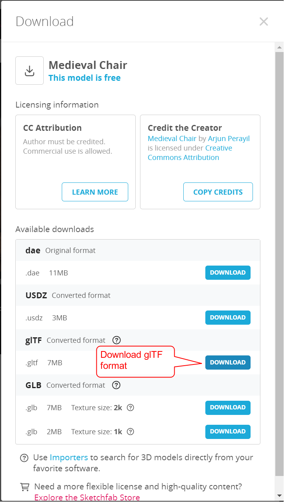
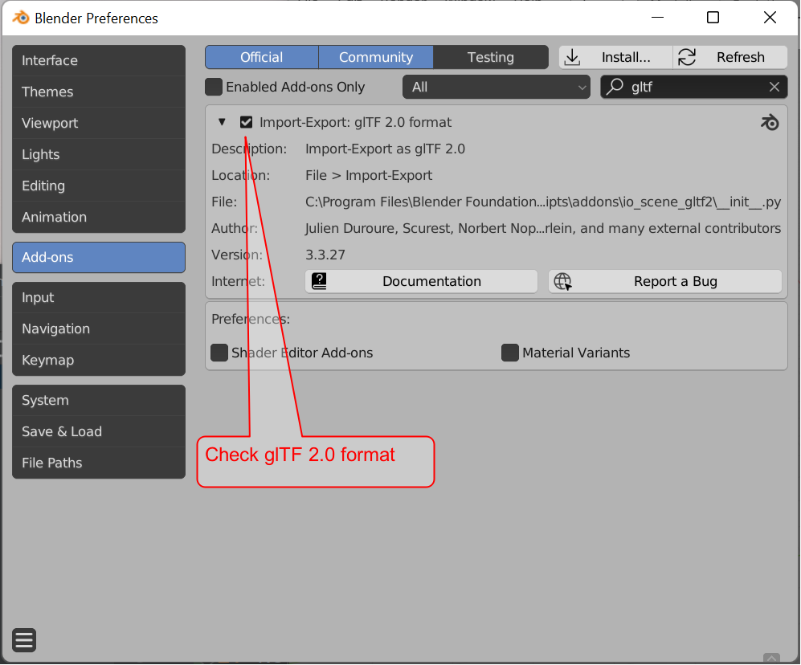
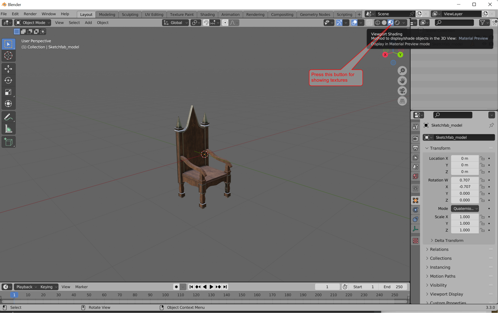
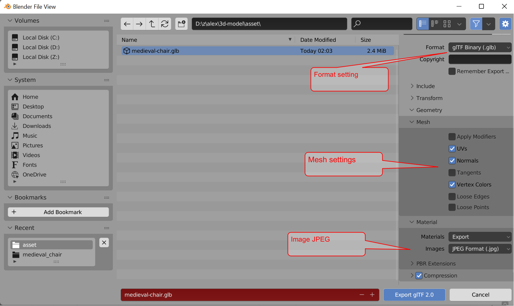
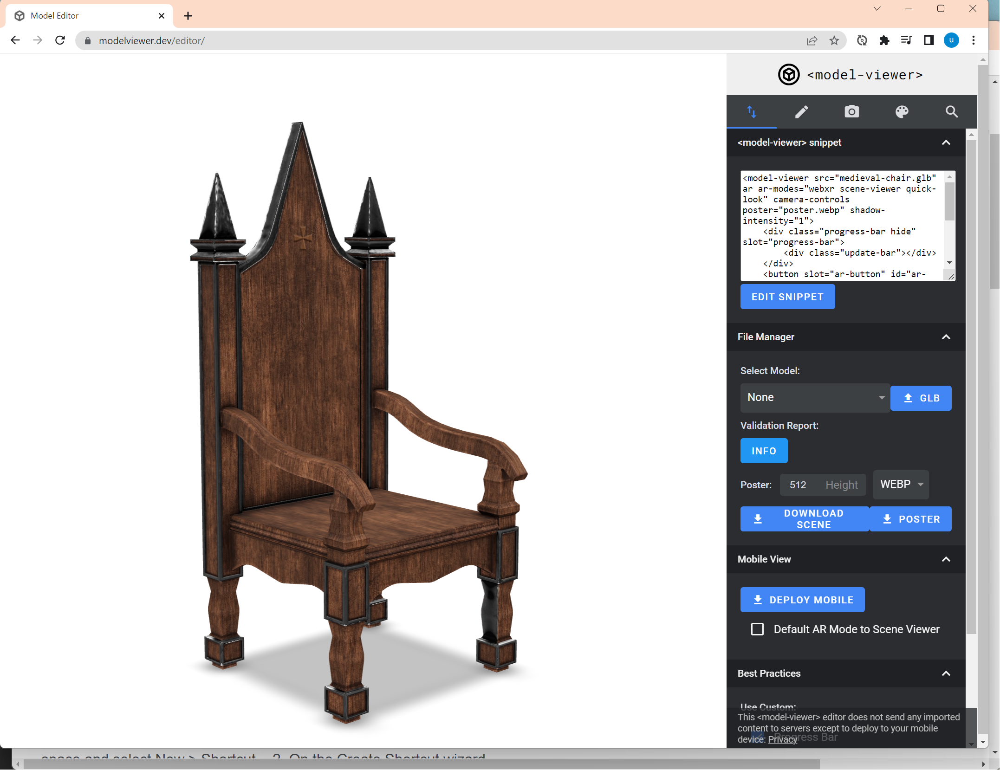

# 3d-model

## Resources
- https://sketchfab.com

## Task 1 -- Download and prepare glTF 3D model

1. Register at https://sketchfab.com
2. Find asset [Medieval Chair](https://sketchfab.com/3d-models/medieval-chair-cf432737e2024b92ae7b5b51a83a90e4)
3. Download glTf model 
4. Extract downloaded model
5. Open Blender or [install](https://www.blender.org/download/) if required
6. Enable glTf 2.0 plugin (Go to Edit > Preferences > Add-ons)
7. Delete cube and camera
8. Import asset in Blender File > Import > GLTF
9. Enable textures
10. Export model File > Export > GLTF
11. Open model in [Google Model Viewer](https://modelviewer.dev/editor/)
